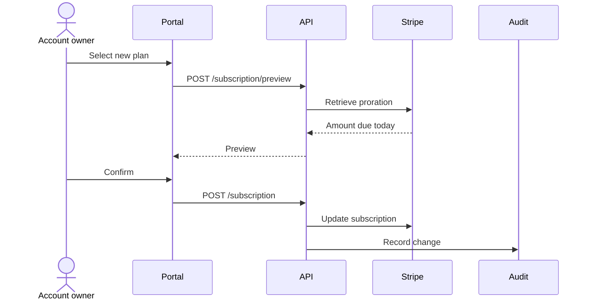
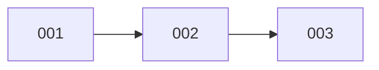

# Example: a filled epic and ticket

Fictional example (the Meridian API project from `agents-md-setup`'s example) showing the target length and tone of Phase 3's output. Use it as a reference, not a template to copy.

Notice the calibration. Context is three sentences. Each story names a real role. The ticket's Scope is a short paragraph a later spec run can start from cold — it states the deliverable and stops, because acceptance criteria are the spec run's job.

---

## `epic.md`

````markdown
# Self-serve plan changes

*2026-03-11*

## Context

Account owners cannot change their plan without emailing support. Support
handles about forty of these a week, and each one is a manual Stripe edit.
This epic moves the change into the portal and makes billing follow it.

## Core user stories

- As an account owner, I want to change my plan in the portal, so that I do not have to email support.
- As an account owner, I want to see what I will be charged before I confirm, so that the invoice holds no surprises.
- As a support agent, I want a record of who changed a plan and when, so that I can answer billing disputes.

## Architecture



### Ticket dependencies



## Board

| # | Ticket | Status |
|---|--------|--------|
| 001 | Proration preview endpoint | todo |
| 002 | Plan change endpoint | todo |
| 003 | Audit trail for plan changes | todo |
````

## `tickets/001-proration-preview.md`

```markdown
---
status: todo
depends_on: []
---

# 001. Proration preview endpoint

## Why

The owner must see the amount due before confirming. Every other ticket in the
epic assumes that number already exists.

## Scope

Add `POST /subscription/preview` to the Meridian API. It takes a target plan
id, asks Stripe for the proration on the caller's current subscription, and
returns the amount due today with the next billing date. Read-only — it
changes nothing in Stripe or in our database.

## Out of scope

Applying the change (ticket 002). The portal screen that renders the preview.
Plan downgrades, which bill differently and were cut from this epic.
```
