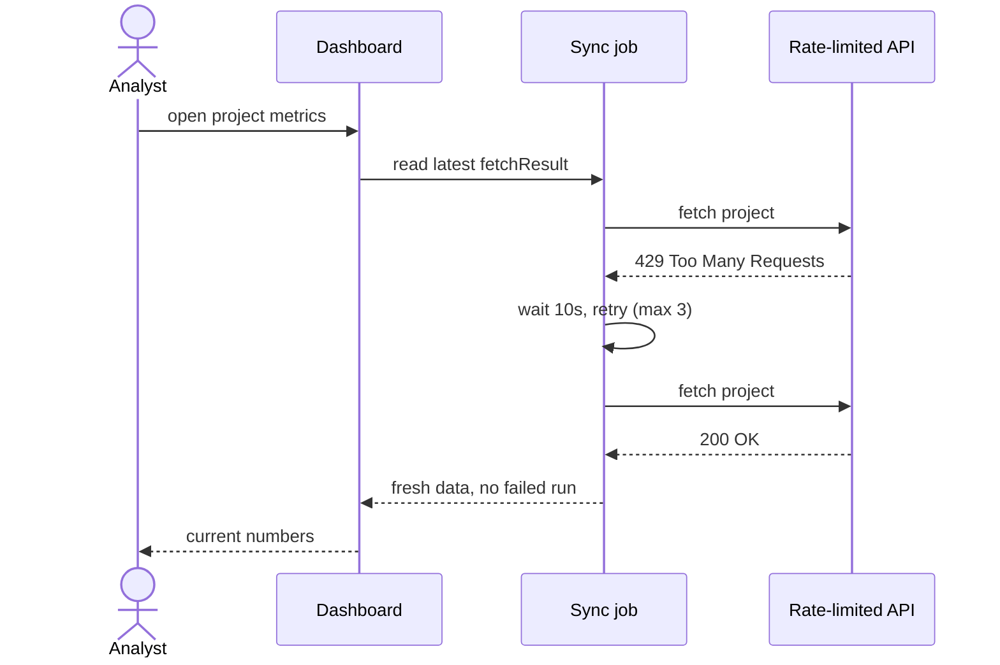
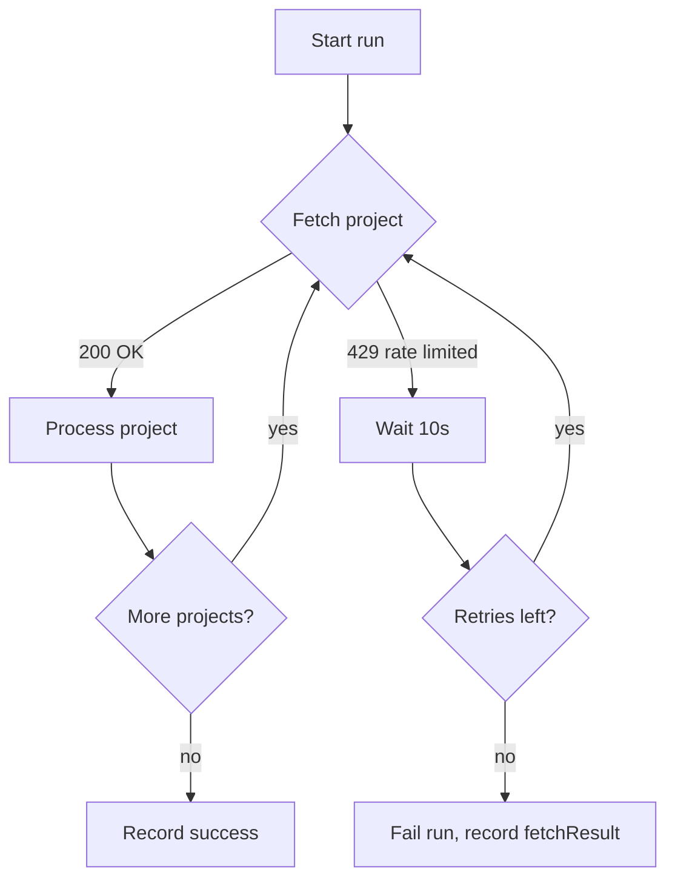

# Add rate-limit retry to the sync job (demo plan)

## Context

This is a **fake plan** used to demo the playbook plan viewer. It exercises the
markdown features the built-in terminal viewer renders poorly: mermaid diagrams,
tables, task lists, and nested code blocks.

The sync job fetches project data through a rate-limited API. When the API
returns HTTP 429, the error propagates up and aborts the entire run. The next
scheduled run starts over and hits the same limit — the job gets stuck making
no progress.

## Core user stories

- As a data analyst, I want project data to keep syncing through API rate limits, so that dashboards never show hours-stale numbers.
- As an on-call engineer, I want exhausted retries to fail loudly with a recorded `fetchResult`, so that a stuck sync is visible from the run history.

## User journey



## Approach

Wrap each project iteration as a retryable unit:



## Changes

| File | Change |
|------|--------|
| `sync/runner.ts` | Wrap per-project loop body in `withRateLimitRetry()` |
| `sync/retry.ts` | New helper: bounded retry with 10s backoff |
| `sync/runner.test.ts` | Cases: transient 429 recovers, exhausted retries fail |

The retry helper:

```typescript
async function withRateLimitRetry<T>(
  fn: () => Promise<T>,
  { retries = 3, waitMs = 10_000 }: RetryOpts = {},
): Promise<T> {
  for (let attempt = 0; ; attempt++) {
    try {
      return await fn();
    } catch (err) {
      if (!isRateLimit(err) || attempt >= retries) throw err;
      await sleep(waitMs);
    }
  }
}
```

## Acceptance criteria

- [ ] A single 429 on one project no longer fails the run
- [ ] A project still rate-limited after 3 retries fails the run with a recorded `fetchResult`
- [ ] Retry waits are logged at `info` level
- [ ] Existing tests stay green

> **Out of scope:** per-sub-call retry granularity — we retry the whole
> project iteration, matching how the API accounts rate limits.
