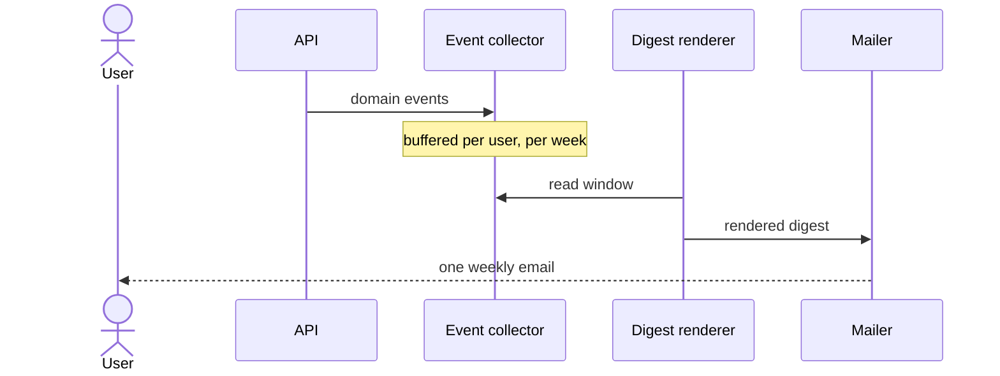
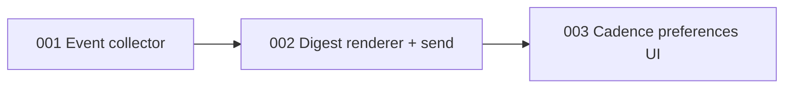

# Weekly notification digest (demo epic)

*2026-07-08*

## Context

This is a **fake epic** used to demo the epic viewer. Users get one email per event today; heavy projects generate dozens a day and people unsubscribe entirely. This epic replaces per-event emails with a weekly digest: collect events, render a summary, and let users pick their cadence.

## Core user stories

- As a project member, I want one weekly summary instead of per-event emails, so that I stay informed without inbox noise.
- As a user, I want to choose my digest cadence, so that high-touch projects can stay real-time.
- As an operator, I want digest sends observable, so that a silent failure doesn't go unnoticed for a week.

## Architecture

### Ticket dependencies

## Board

| # | Ticket | Status |
|---|--------|--------|
| 001 | Event collector | done |
| 002 | Digest renderer and weekly send | in-progress |
| 003 | Cadence preferences UI | todo |
